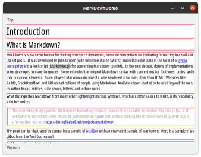

BeamUI Markdown widget
======================

BeamUI markdown viewer.

I started this project to test the graphic and css function of BeamUI.

## System and Tools Version

- Linux
  - Ubuntu 20.04 LTS
  - LDC (1.20.1)
- Windows
  - Windows 10
  - LDC
  - Visual Studio Community Edition 2019

## TODO

- [x] lists
- [ ] image view
- [ ] table
- [ ] front matter
- [ ] css
- [ ] reimplement visitor with 2 step - format and render

## Long Term

- [ ] tooltip on URL
- [ ] Syntax highlight
- [ ] HarfBuzz

Screen Shot
-----------



Tricks
------

```
dub add-local ~/work/beamui
```

Blog
----

Blog in Korean: [https://seoyoungjin.github.com](https://seoyoungjin.github.com)
